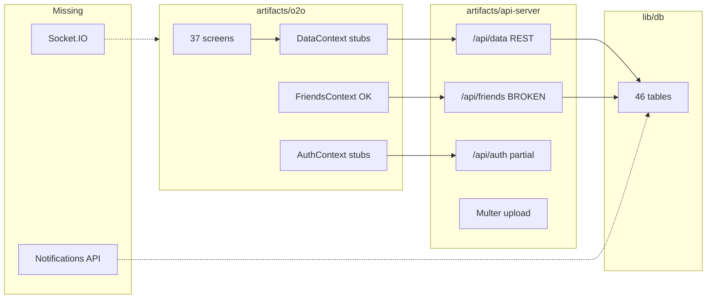

# O2O Master Refactor Plan

## Current state (audit summary)

The monorepo is **not a greenfield rewrite**. Most UI screens and REST endpoints already exist, but several integration layers are broken or stubbed.



| Area | Status |
|------|--------|
| DB schema (46 tables) | Strong — single source in [`lib/db/src/schema/index.ts`](lib/db/src/schema/index.ts) |
| Frontend screens | 37 wired routes in [`artifacts/o2o/app/`](artifacts/o2o/app/) |
| Core REST (`/api/data`) | Working for channels, chats, groups, bids, orders, reviews, wishlist |
| Friends API | **Broken** — uses `req.userId` but auth sets `req.user.userId` in [`artifacts/api-server/src/routes/friends.ts`](artifacts/api-server/src/routes/friends.ts) |
| DataContext | **5 no-op handlers** + mutations that return `undefined` in [`artifacts/o2o/context/DataContext.tsx`](artifacts/o2o/context/DataContext.tsx) |
| AuthContext | `getUserById` / `getFriends` are hardcoded stubs in [`artifacts/o2o/context/AuthContext.tsx`](artifacts/o2o/context/AuthContext.tsx) |
| Socket.IO | **Not implemented anywhere** (0 matches in repo) |
| Notifications | Table exists; **no user-facing API or UI** |
| Expo | Already migrated off Expo; compat shims remain in [`artifacts/o2o/compat/`](artifacts/o2o/compat/) |
| iOS | No `ios/` project; remove `Platform.OS === "ios"` branches per spec |

**Delivery approach (per your choice):** MVP first — critical fixes + auth/friends/chat/channels/bids/orders, then advanced chat (reactions, polls, typing, etc.) and polish.

---

## Phase 1 — Critical bug fixes (unblock core flows)

These are small diffs with high impact; do first.

### 1.1 Fix friends API auth bug
In [`artifacts/api-server/src/routes/friends.ts`](artifacts/api-server/src/routes/friends.ts), replace all `req.userId` with `req.user!.userId` (matches [`artifacts/api-server/src/middlewares/auth.ts`](artifacts/api-server/src/middlewares/auth.ts)).

### 1.2 Fix frontend context wiring
- **DataContext** ([`artifacts/o2o/context/DataContext.tsx`](artifacts/o2o/context/DataContext.tsx)):
  - Implement `repostProduct`, `sendChannelMessage`, `rejectBid`, `endBid`, `updateOrderStatus` with real API calls
  - Change `createChat` / `createGroup` to `async` mutations that return created entity (fix broken navigation in [`artifacts/o2o/app/new-chat.tsx`](artifacts/o2o/app/new-chat.tsx) and [`artifacts/o2o/app/group/create-details.tsx`](artifacts/o2o/app/group/create-details.tsx))
- **AuthContext** ([`artifacts/o2o/context/AuthContext.tsx`](artifacts/o2o/context/AuthContext.tsx)):
  - Remove `getFriends()` stub — screens should use `FriendsContext` instead (fix [`artifacts/o2o/app/group/create.tsx`](artifacts/o2o/app/group/create.tsx))
  - Replace `getUserById` stub with API lookup (new route below)

### 1.3 Add missing REST endpoints in [`artifacts/api-server/src/routes/api.ts`](artifacts/api-server/src/routes/api.ts)

| Endpoint | Purpose |
|----------|---------|
| `GET /api/users/:id` | Public profile lookup for chat headers |
| `POST /api/data/channels/:id/messages` | Channel posts (frontend `sendChannelMessage` is no-op) |
| `GET /api/data/channels/:id/messages` | Load channel messages (currently hardcoded `messages: []`) |
| `POST /api/data/channels/:id/products/:productId/repost` | Clone product to new record (do not mutate original) |
| `POST /api/data/bids/:id/reject` | Write to `bid_rejections` table |
| `POST /api/data/bids/:id/end` | End bid early, set status `ended` |
| `PATCH /api/data/orders/:id/status` | Order confirmation/delivery flow |
| `PATCH /api/data/groups/:id` | Rename, description, image updates |
| `POST /api/data/groups/:id/members` / `DELETE .../members/:userId` | Add/remove members |

Wire corresponding mutations in `DataContext` and regenerate/update [`lib/api-client-react`](lib/api-client-react) if needed.

### 1.4 Upload metadata
In [`artifacts/api-server/src/routes/upload.ts`](artifacts/api-server/src/routes/upload.ts), after Multer save, insert row into `file_uploads` table so admin file manager and audit trail work.

---

## Phase 2 — Auth hardening (MVP)

### 2.1 OTP persistence + Nodemailer
- Add `password_reset_otps` table to [`lib/db/src/schema/index.ts`](lib/db/src/schema/index.ts): `email`, `otpHash`, `expiresAt`, `verifiedAt`
- Refactor [`artifacts/api-server/src/routes/auth.ts`](artifacts/api-server/src/routes/auth.ts):
  - Store hashed OTP with 10-min TTL
  - Remove OTP from JSON response in production
  - Require verified OTP before `reset-password`
- Implement [`artifacts/api-server/src/lib/delivery.ts`](artifacts/api-server/src/lib/delivery.ts) with **Nodemailer** + `SMTP_*` env vars; log OTP to console when SMTP unset (dev fallback)
- Add rate limiting on OTP routes (reuse existing `express-rate-limit`)

### 2.2 JWT refresh flow
- Add `refresh_tokens` table (token hash, userId, expiresAt, revokedAt)
- Extend auth routes: `POST /api/auth/refresh`, `POST /api/auth/logout`
- Issue short-lived access token (15m) + long-lived refresh token (7d)
- Update [`artifacts/o2o/context/AuthContext.tsx`](artifacts/o2o/context/AuthContext.tsx) + [`lib/api-client-react`](lib/api-client-react) to auto-refresh on 401

### 2.3 Validation + security
- Add Zod validation on auth and data routes using [`lib/api-zod`](lib/api-zod)
- Fail fast if `JWT_SECRET` unset in production (remove fallback in auth middleware)
- Enforce friends-only chat: in chat create/message routes, verify `friends_contacts.status === 'accepted'`

---

## Phase 3 — Friends, home, notifications (MVP)

### 3.1 Friends (mostly done once bug fixed)
- Verify accept/reject creates bidirectional rows correctly in [`friends.ts`](artifacts/api-server/src/routes/friends.ts)
- On friend request/accept/reject, insert notification rows (see 3.3)

### 3.2 Home screen ([`artifacts/o2o/app/(tabs)/index.tsx`](artifacts/o2o/app/(tabs)/index.tsx))
- Replace static search with navigation to [`people-search`](artifacts/o2o/app/people-search.tsx) + unified search across chats/groups/channels
- Wire bell icon to notifications screen (new)
- Show recent chats, groups, channels with unread counts from API

### 3.3 Notifications API + screen
- New route file [`artifacts/api-server/src/routes/notifications.ts`](artifacts/api-server/src/routes/notifications.ts):
  - `GET /api/notifications`, `POST /api/notifications/:id/read`, `POST /api/notifications/read-all`
- Create notifications on: friend events, new messages, group invites, bid/offer/order events
- New screen [`artifacts/o2o/app/notifications.tsx`](artifacts/o2o/app/notifications.tsx) + register in [`app/_layout.tsx`](artifacts/o2o/app/_layout.tsx)

---

## Phase 4 — Chat MVP (text + media + friends-only)

Current `messages` table only has `text`. Extend minimally without breaking existing data:

```typescript
// Add to messages table in schema:
type: text enum ['text','image','video','audio','file','location','poll']
replyToId, editedAt, deletedAt (nullable)
metadata: jsonb  // attachments, poll options, location coords
```

### Backend
- Paginated message fetch: `GET /api/data/chats/:id/messages?cursor=&limit=`
- Message edit/delete endpoints with authorization checks
- Attachments via existing upload flow + `chat_attachments` table
- Friend-only enforcement on chat create/send

### Frontend
- Fix [`artifacts/o2o/app/chat/[id].tsx`](artifacts/o2o/app/chat/[id].tsx): use real user names from API, remove fake "Online" until presence is implemented
- Add image/file picker (already used in [`channel/post.tsx`](artifacts/o2o/app/channel/post.tsx)) to chat
- Infinite scroll on message list
- Same patterns for [`group/[id].tsx`](artifacts/o2o/app/group/[id].tsx) and [`order/[id].tsx`](artifacts/o2o/app/order/[id].tsx)

### Groups MVP
- Wire group image upload in [`group/create-details.tsx`](artifacts/o2o/app/group/create-details.tsx)
- Admin-only member management using new group PATCH/member routes

---

## Phase 5 — Channels, products, bids, orders (MVP)

### 5.1 Channels
- [`channel/[id].tsx`](artifacts/o2o/app/channel/[id].tsx): load/post channel messages via new API; enforce seller-only posting
- Buyer view read-only (hide post UI when `user.role === 'buyer'` or not owner/admin)
- Multi-image products: use `product_images` table on create in [`channel/post.tsx`](artifacts/o2o/app/channel/post.tsx)
- Implement repost in [`channel/repost.tsx`](artifacts/o2o/app/channel/repost.tsx) via repost endpoint

### 5.2 Bids
- Set default `endTime` to **30 minutes** from creation in bid POST
- Add server-side cron/interval in [`artifacts/api-server/src/index.ts`](artifacts/api-server/src/index.ts) to auto-close expired bids
- Implement `rejectBid` in [`bid/reject/[id].tsx`](artifacts/o2o/app/bid/reject/[id].tsx)
- [`bid/live/[id].tsx`](artifacts/o2o/app/bid/live/[id].tsx): wire `endBid`; mask seller identities for competing sellers (filter offers server-side by role)
- Winner selection → auto-create order record

### 5.3 Orders + reviews
- Wire `updateOrderStatus` in [`order/[id].tsx`](artifacts/o2o/app/order/[id].tsx) for confirm/deliver flow
- [`review/[id].tsx`](artifacts/o2o/app/review/[id].tsx): connect to existing review POST; optional photo via upload

---

## Phase 6 — Socket.IO realtime (MVP scope)

Add `socket.io` to [`artifacts/api-server/package.json`](artifacts/api-server/package.json) and `socket.io-client` to [`artifacts/o2o/package.json`](artifacts/o2o/package.json).

### Server ([`artifacts/api-server/src/socket/index.ts`](artifacts/api-server/src/socket/index.ts) — new)
- Attach to HTTP server in [`src/index.ts`](artifacts/api-server/src/index.ts)
- JWT auth on connection (same secret as REST)
- Rooms: `user:{id}`, `chat:{id}`, `bid:{id}`
- Events (MVP):
  - `message:new`, `message:edit`, `message:delete`
  - `bid:offer`, `bid:ended`, `bid:winner`
  - `notification:new`
  - `typing:start`, `typing:stop` (Phase 7)

### Client ([`artifacts/o2o/lib/socket.ts`](artifacts/o2o/lib/socket.ts) — new)
- Connect on login, disconnect on logout
- Invalidate React Query caches or append optimistically on events
- Reconnection with exponential backoff

Emit from REST handlers after DB writes (single source of truth).

---

## Phase 7 — Advanced chat + polish (post-MVP)

Deferred per MVP-first choice:

- Reactions (`chat_reactions` table + UI)
- Polls, location messages
- Delivered/seen status
- Online presence (last-seen in `users` or separate table)
- Typing indicators via Socket.IO
- Media gallery screen
- Profile/settings screens: wire toggles to `user_settings` via `/api/extended/userSettings` or dedicated routes
- Theme persistence (likely already partially in settings)

---

## Phase 8 — Cleanup and platform constraints

### Remove iOS-specific code
- Strip `Platform.OS === "ios"` branches in tab layout, forms, ErrorFallback — use Android/Web behavior only
- Remove any `pnpm ios` / `build:ios` scripts from [`artifacts/o2o/package.json`](artifacts/o2o/package.json)

### Remove Expo remnants
- Update [`artifact/artifact.toml`](artifact/artifact.toml) references from "expo" to "react-native"
- Keep `compat/` shims (they replace Expo APIs for RN Web — not Expo dependencies)

### DB migrations
- Generate initial migration from current schema via `drizzle-kit generate` in [`lib/db`](lib/db)
- Document `pnpm push` vs migration workflow in existing README only if one exists (no new docs unless requested)

### Quality gates
- Run `pnpm typecheck` at root
- Manual smoke test: Android emulator + Vite web dev server
- Verify no mock data in production screens (remove dev OTP UI in [`verify-otp.tsx`](artifacts/o2o/app/verify-otp.tsx) when `!__DEV__`)

---

## Key files to touch (by priority)

| Priority | Files |
|----------|-------|
| P0 | [`friends.ts`](artifacts/api-server/src/routes/friends.ts), [`DataContext.tsx`](artifacts/o2o/context/DataContext.tsx), [`AuthContext.tsx`](artifacts/o2o/context/AuthContext.tsx) |
| P1 | [`api.ts`](artifacts/api-server/src/routes/api.ts), [`auth.ts`](artifacts/api-server/src/routes/auth.ts), [`schema/index.ts`](lib/db/src/schema/index.ts) |
| P2 | [`index.ts`](artifacts/api-server/src/index.ts) (socket + bid cron), new `socket/` + `notifications.ts` |
| P3 | Chat/channel/bid/order screens under [`artifacts/o2o/app/`](artifacts/o2o/app/) |
| P4 | [`upload.ts`](artifacts/api-server/src/routes/upload.ts), [`delivery.ts`](artifacts/api-server/src/lib/delivery.ts) |

---

## MVP acceptance checklist

After Phases 1–6, the app should pass:

- [ ] Signup/login/logout with refresh tokens
- [ ] Forgot password + OTP via Nodemailer (SMTP env)
- [ ] Friends search, request, accept/reject work
- [ ] Private chat (text + image) between friends only
- [ ] Groups create, message, basic admin edits
- [ ] Channels: seller posts, buyer read-only, wishlist, repost
- [ ] Bids: 30-min countdown, offers, reject, winner → order
- [ ] Orders: status updates, order chat, reviews
- [ ] Notifications list + realtime via Socket.IO
- [ ] Uploads persist to disk + `file_uploads`
- [ ] Android + Web run without Expo; no iOS code paths
- [ ] No stub handlers or mock user data in MVP screens

Phase 7 completes the remaining advanced chat and settings items from the original prompt.
